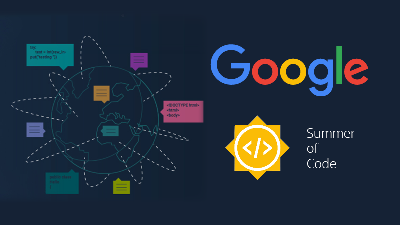

## Google Summer of Code (GSoC)

[Google Summer of Code (GSoC)](https://summerofcode.withgoogle.com/) is an annual global program focused on bringing new contributors into open source software development.  
Contributors work with open source organizations under the guidance of mentors to learn, code, and make impactful contributions during the summer.

### GSoC 2025 Highlights
- **15,240 applicants** from **130 countries** submitted **23,559 proposals**  
- **185 mentoring organizations** selected **1,272 contributors** from **68 countries**  
- **66.3% of contributors** had *no prior open source experience*, showing GSoC’s accessibility  
- A **three-week Community Bonding period** helps contributors and mentors plan and get oriented before coding  

🔗 [Read more on the official announcement](https://opensource.googleblog.com/2025/05/gsoc-2025-we-have-our-contributors.html)

## About INCF

The [International Neuroinformatics Coordinating Facility (INCF)](https://www.incf.org/) is an open and FAIR (Findable, Accessible, Interoperable, and Reusable) neuroscience standards organization.  
Launched in 2005 through a proposal from the OECD Global Science Forum, INCF’s mission is to make neuroscience data and knowledge **globally shareable and reusable**.

### Impact on Society
By developing community-driven standards and tools for data sharing, analysis, modeling, and simulation, INCF:
- Promotes **collaboration** across international neuroscience communities  
- Enables **reproducible and scalable research**  
- Accelerates **discoveries in brain science**  
- Supports better understanding of brain function in both **health and disease**  

Through these efforts, INCF helps build a more open scientific ecosystem, ultimately contributing to advances in healthcare, mental health, and neurological research worldwide.

